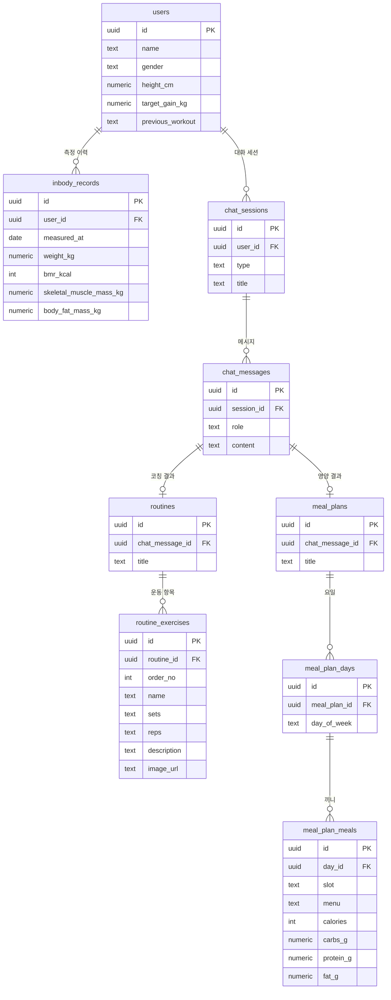

# DB 설계 (Supabase Postgres / MVP)

`architecture.md`의 스키마 스케치를 실제 DDL로 확정한 문서. 스키마의 단일 출처(single source of truth)는 이 파일이다.

## 1. 전제

- DB는 Supabase Postgres, 백엔드(Railway)가 **유일한 DB 클라이언트**다. 프론트/AI 서버는 DB에 직접 접근하지 않는다.
- MVP는 로그인이 없다. 고정 더미 유저 1명을 시드해두고 백엔드가 그 id를 설정값으로 들고 쓴다.
- 인바디는 시계열 데이터다 (와이어프레임 "Last Data 2026.06.20", 막대 그래프).

## 2. ERD



## 3. DDL

Supabase SQL Editor에 바로 붙여넣을 실행 순서대로 합친 스크립트는 [`schema.sql`](./schema.sql)에 있다.
아래는 테이블별 설계 근거와 함께 보는 설명용이며, 스키마를 바꿀 때는 이 문서와 `schema.sql`을 함께 수정한다.

### users

성명·성별·키·목표 증가량·전날 운동. 측정할 때마다 바뀌지 않는 프로필 속성만 담는다.

```sql
create table users (
  id               uuid primary key default gen_random_uuid(),
  name             text not null,                                    -- 성명
  gender           text not null check (gender in ('MALE', 'FEMALE')), -- 성별
  height_cm        numeric(4,1) not null check (height_cm > 0),      -- 키
  target_gain_kg   numeric(4,1),                                     -- 목표 증가량
  previous_workout text check (previous_workout in ('UPPER_BODY', 'LOWER_BODY')), -- 전날 운동
  created_at       timestamptz not null default now()
);
```

`target_gain_kg`, `previous_workout`은 nullable — 목표 미설정 상태와 첫 이용(운동 이력 없음)이 존재한다.

### inbody_records

체중·기초대사량·골격근량·체지방량. 메인 하단 패널은 이 중 최신 1건을 표시한다.

```sql
create table inbody_records (
  id                      uuid primary key default gen_random_uuid(),
  user_id                 uuid not null references users(id) on delete cascade,
  measured_at             date not null,                                    -- "Last Data" 표기
  weight_kg               numeric(5,2) not null check (weight_kg > 0),      -- 체중
  bmr_kcal                integer      not null check (bmr_kcal > 0),       -- 기초대사량
  skeletal_muscle_mass_kg numeric(5,2) not null check (skeletal_muscle_mass_kg > 0), -- 골격근량
  body_fat_mass_kg        numeric(5,2) not null check (body_fat_mass_kg >= 0),       -- 체지방량
  created_at              timestamptz not null default now(),
  unique (user_id, measured_at)
);

create index idx_inbody_user_measured
  on inbody_records (user_id, measured_at desc);
```

인덱스는 `GET /api/inbody/recent`의 "유저의 최신 1건" 조회 패턴에 대응한다 (`where user_id = ? order by measured_at desc limit 1`).

### chat_sessions

좌측 "최근 채팅내역" 목록. "새 채팅시작"이 새 행을 만든다.

```sql
create table chat_sessions (
  id         uuid primary key default gen_random_uuid(),
  user_id    uuid not null references users(id) on delete cascade,
  type       text not null check (type in ('COACHING', 'NUTRITION')),
  title      text,
  created_at timestamptz not null default now()
);

create index idx_chat_sessions_user_created
  on chat_sessions (user_id, created_at desc);
```

`type`이 세션에 붙는 이유: 코칭/영양은 우측 탭으로 분리된 별개 대화 맥락이므로, 세션 하나가 두 AI를 오가지 않는다.

### chat_messages

대화 메시지 본문. AI 생성 결과(운동루틴/식단표)는 아래 `routines`/`meal_plans`가 이 테이블을
참조하는 방식으로 붙는다 — 이 테이블 자체는 결과를 담지 않는다.

```sql
create table chat_messages (
  id         uuid primary key default gen_random_uuid(),
  session_id uuid not null references chat_sessions(id) on delete cascade,
  role       text not null check (role in ('USER', 'ASSISTANT')),
  content    text not null,
  created_at timestamptz not null default now()
);

create index idx_chat_messages_session_created
  on chat_messages (session_id, created_at);
```

인덱스는 세션 상세 조회(`where session_id = ? order by created_at`)와 AI 호출 시 대화 이력 조립에 함께 쓰인다.

### routines / routine_exercises

코칭 AI 결과. 어시스턴트 메시지 1건당 루틴 0~1개, 루틴 1개당 운동 여러 개.
와이어프레임의 운동루틴 카드(운동명 / 상세 설명 / 3~4세트 8~12회 / 이미지)에 대응.

```sql
create table routines (
  id              uuid primary key default gen_random_uuid(),
  chat_message_id uuid not null unique references chat_messages(id) on delete cascade,
  title           text not null,
  created_at      timestamptz not null default now()
);

create table routine_exercises (
  id           uuid primary key default gen_random_uuid(),
  routine_id   uuid not null references routines(id) on delete cascade,
  order_no     integer not null check (order_no > 0),  -- 카드 내 노출 순서
  name         text not null,                          -- "등업"
  sets         text not null,                           -- "3~4세트"
  reps         text not null,                           -- "8~12회"
  description  text,
  image_url    text,
  unique (routine_id, order_no)
);
```

`chat_message_id`에 `unique`를 걸어 메시지 1건당 루틴을 최대 1개로 제한한다.
`sets`/`reps`는 "3~4세트"처럼 범위 표기라 숫자로 쪼개지 않고 텍스트 그대로 저장한다 —
집계가 필요해지면(예: 세트 수 평균) 그때 최소/최대 숫자 컬럼으로 분리한다.

### meal_plans / meal_plan_days / meal_plan_meals

영양 AI 결과. 주간 식단표(MON~SUN × 아침/점심/저녁)에 대응하는 3단 구조.

```sql
create table meal_plans (
  id              uuid primary key default gen_random_uuid(),
  chat_message_id uuid not null unique references chat_messages(id) on delete cascade,
  title           text not null,
  created_at      timestamptz not null default now()
);

create table meal_plan_days (
  id            uuid primary key default gen_random_uuid(),
  meal_plan_id  uuid not null references meal_plans(id) on delete cascade,
  day_of_week   text not null check (day_of_week in ('MON','TUE','WED','THU','FRI','SAT','SUN')),
  unique (meal_plan_id, day_of_week)
);

create table meal_plan_meals (
  id         uuid primary key default gen_random_uuid(),
  day_id     uuid not null references meal_plan_days(id) on delete cascade,
  slot       text not null check (slot in ('BREAKFAST', 'LUNCH', 'DINNER')),
  menu       text not null,
  calories   integer check (calories >= 0),
  carbs_g    numeric(5,1),
  protein_g  numeric(5,1),
  fat_g      numeric(5,1),
  unique (day_id, slot)
);
```

`unique (meal_plan_id, day_of_week)`와 `unique (day_id, slot)`이 각각 "하루는 요일당 1행",
"한 끼는 슬롯당 1행"을 강제한다 — 같은 날 아침이 중복 저장되는 경우가 구조적으로 불가능하다.

## 4. 시드 (더미 유저)

백엔드가 설정값으로 참조할 수 있도록 id를 고정한다.

```sql
insert into users (id, name, gender, height_cm, target_gain_kg, previous_workout)
values ('00000000-0000-0000-0000-000000000001',
        '홍길동', 'MALE', 175.0, 3.0, 'UPPER_BODY');
```

```properties
# application.properties
app.mvp.dummy-user-id=00000000-0000-0000-0000-000000000001
```

인증 도입 시 이 설정을 제거하고 JWT에서 유저를 꺼내도록 교체한다. 그 지점 외에는 스키마 변경이 없다.

## 5. 설계 판단

**enum 대신 text + CHECK.** Postgres 네이티브 enum은 값 추가가 번거롭고 삭제가 불가능하다. MVP 단계에서
운동 부위·AI 타입은 바뀔 가능성이 높으므로, CHECK 제약이 변경 비용이 낮다. 값이 굳으면 그때 enum으로 옮긴다.

**운동/식단을 처음부터 정규화.** 애초 안은 `chat_messages.result` jsonb 한 컬럼에 통째로 저장하는
것이었다 — AI와 결과 스키마를 합의하는 중이라 구조가 바뀔 여지가 크다는 이유였다. 이번에 정규화로
전환하면서 그 트레이드오프가 뒤집혔다: 운동/끼니 단위로 조회·집계("종합 데이터")할 수 있게 되는 대신,
AI 응답에 필드가 추가·변경될 때마다 컬럼 마이그레이션이 필요해진다. `sets`/`reps`처럼 아직 세부
구조가 불확실한 값은 텍스트 컬럼으로 남겨 이 비용을 낮췄다.

**RLS 미적용.** Supabase RLS는 클라이언트가 DB에 직접 붙을 때의 방어 수단이다. 이 구조에서는 백엔드만
DB에 접근하고 권한 판단도 백엔드가 하므로 MVP에서는 켜지 않는다. 다만 나중에 프론트가 Supabase SDK로
직접 붙는 설계가 나오면 그 시점에 반드시 재검토해야 한다.

**`public.users`는 Supabase `auth.users`와 별개다.** 인증 도입 시 두 테이블을 지우고 합치는 게 아니라,
`public.users`에 `auth_id uuid references auth.users(id)` 컬럼을 추가해 연결하는 방향이 자연스럽다.

**cascade 삭제.** 유저 삭제 시 인바디·세션이, 세션 삭제 시 메시지가, 메시지 삭제 시 그 메시지의
루틴/식단표(및 하위 운동·요일·끼니)가 함께 지워진다. 고아 행이 남을 경로가 없다.

## 6. 적용에 필요한 것

현재 `build.gradle`에는 DB 관련 의존성이 없다. DB 작업을 시작하려면 추가가 필요하다.

```gradle
implementation 'org.springframework.boot:spring-boot-starter-data-jpa'
runtimeOnly 'org.postgresql:postgresql'
```

**연결 방식: Supavisor session mode 풀러 (5432).**

```properties
# application.properties (커밋됨)
spring.profiles.active=local
spring.datasource.url=jdbc:postgresql://aws-1-ap-northeast-2.pooler.supabase.com:5432/postgres?sslmode=require
spring.datasource.username=postgres.qvuuptnvrybesmhuoxdv
```

비밀번호는 커밋되는 파일에 두지 않는다.

- **로컬**: `application-local.properties`(gitignore 대상)에 `spring.datasource.password=…`
- **Railway**: 환경변수 `SPRING_DATASOURCE_PASSWORD` 등록. Spring의 relaxed binding이
  `spring.datasource.password`로 매핑하며, 환경변수가 프로퍼티 파일보다 우선하므로
  `spring.profiles.active=local`이 켜져 있어도 Railway 값이 이긴다.

Supabase 풀러는 포트로 모드가 갈린다 — **5432는 session mode, 6543은 transaction mode**다.
transaction mode였다면 서버 사이드 prepared statement가 깨져 `prepareThreshold=0`이 필요하지만,
session mode는 커넥션을 세션 동안 독점하므로 Hibernate가 그대로 동작한다. **이 설정에는 붙이지 않는다.**
나중에 커넥션 수 문제로 6543으로 옮기게 되면 그때 `prepareThreshold=0`을 추가해야 한다.

DDL 적용은 MVP에서는 Supabase SQL Editor에서 직접 실행한다. 스키마 변경이 잦아지면 Flyway 도입을 검토한다.
(`spring.jpa.hibernate.ddl-auto`는 운영 DB에 쓰지 않는다.)

## 7. 미결 사항

- **인바디 입력 경로 미정** — 사용자 직접 입력 / 기기·API 연동 / 시드만. 현재 설계에 쓰기 경로가 없다.
  직접 입력이라면 `POST /api/inbody`가 추가되며, **테이블 구조는 그대로**다.
- **`unique (user_id, measured_at)`** — 하루 1회 측정을 가정했다. 하루 여러 번 측정을 허용해야 하면
  이 제약을 빼고 `measured_at`을 `timestamptz`로 바꾼다.
- **`chat_sessions.title` 생성 규칙 미정** — 첫 사용자 메시지를 잘라 쓰는 방식을 가정하고 nullable로 뒀다.
- **"최근 채팅내역" 정렬 기준** — 현재 `created_at`(세션 생성순). 마지막 대화순으로 정렬해야 하면
  `updated_at` 컬럼 추가가 필요하다.
- **"종합 데이터" 화면 요구사항 미정** — 어떤 집계가 필요한지에 따라 `routine_exercises`/
  `meal_plan_meals`에 인덱스가 추가로 필요할 수 있다 (예: 운동명별 빈도 집계라면 `name` 인덱스).
- **AI 응답 스키마가 이 DDL과 다르게 확정될 경우** — 정규화된 구조라 jsonb 때보다 마이그레이션
  비용이 크다. AI 서버와 `architecture.md` 4장의 `result` 스키마를 합의할 때 이 문서와 나란히 맞춰야 한다.
